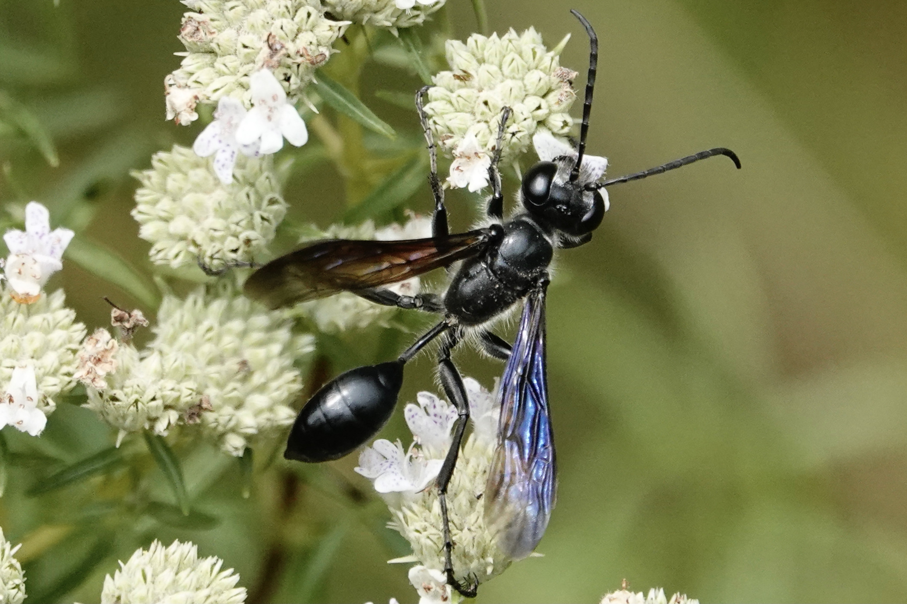
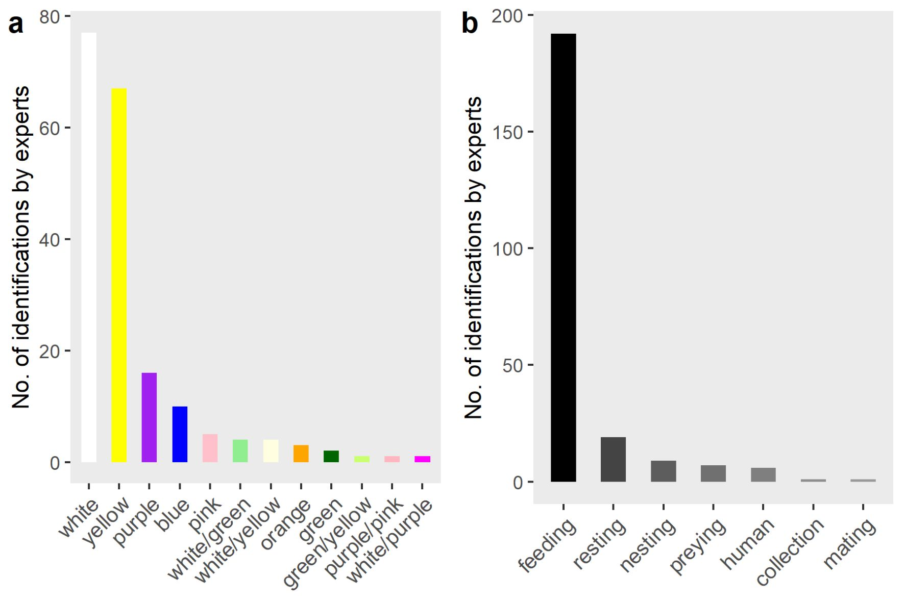

# Introduction

Launched in 2008, [iNaturalist](https://www.inaturalist.org/) has become a worldwide platform for recording and sharing nature’s observations, mostly evidenced through photographs  of the organism. It is probably the single largest source of Open insect observations globally. These observations are used to identify the species by consensus of the community and thus support scientists with research quality data to understand and protect biodiversity. [Pl@ntNet](https://plantnet.org/en/) is a similarly well used system, also with global scope, but with a focus on plants [@10.1002/2688-8319.12023]. Both platforms use machine learning to help users identify the species they have photographed.

Recently, not only the primary observations (e.g. the identified species on the image) are used for research, but also the additional, mostly inadvertently documented information in the pictures have gained attention - the so-called secondary data [@10.1093/biosci/biaa131]. Pioneer studies have used iNaturalist secondary data to learn more about ecological interactions, e.g. measure the predation pressure on lizards by estimating their tail length [10.1038/s41598-021-82491-y] or to document changes in bat handling due to the Covid pandemic [@10.3897/BDJ.9.e68052]. 

In this study, we investigated the possibility of inferring information about interactions between plants and pollinators from iNaturalist images. Insects are often photographed on plants, particularly on flowers, where they can be easily observed and stay still. The platform also provides users with an observation field to record the plant species the pollinator is visiting, but what can you do if you are not a botanist and cannot identify the flower?. This can be remedied by apps that identify plants using computer-based image recognition, such as Pl@ntNet, hereafter referred to as plantNet or simply the App. By sending an image to the App, the user receives a list of suggestions with probability scores for candidate species based on image recognition by a convolutional neural network. Theoretically, it should be possible - the main idea of this study - to feed iNaturalist photographs of specific pollinators into plantNet to obtain information about which plants they are visiting.

We selected the Mexican grass-carrying wasp, *Isodontia mexicana* (Saussure, 1867), Sphecidae, as the target pollinator from iNaturalist primary observations. This wasp is of particular interest for this and future studies for several reasons. First, it has a characteristic morphology and feeds on nectar, which is why it is frequently recorded on plants. Second, it is an invasive species in Europe first introduced in France in the 1960ies [@Kelner-Pillaut:1962], and little is known about its invasion biology [@10.19263/REDIA-103.20.10]. iNaturalist observations include its invasive range, but also its native range in North America. Third, because of the wasps' intriguing behavior of carrying grass leaves and prey for their larvae, such as grasshoppers, into their nests, other types of interactions may be recorded by citizen scientists in addition to those with plants. 

**Figure 1.** A photograph of *Isodontia mexicana* visiting flowers of *Pycnanthemum tenuifolium* posted to [iNaturalist](https://www.inaturalist.org/observations/91809468) from its native range in North America. 	© Louise Woodrich, used under the {CC-By](http://creativecommons.org/licenses/by/4.0/) license.

The objective of the test study was 
1. to assess the accuracy of plantNet identifications by establishing score thresholds above which identifications by the App and botanist experts agree at the species, genus, and family levels,
2. to create a list of plant species *I. mexicana* feeds on/visits based on iNaturalist images and matching it with the existing literature and evidences from [GloBI](https://www.globalbioticinteractions.org/) interaction data from Romania, the host location of the Hackathon,
3. to identify possible flower colour preferences of *I. mexicana*
4. to recognise possible other ecological interactions captured in the images.

## Methods
### iNaturalist data
Observations of *I. mexicana* were retrieved from the iNaturalist platform on March 6th, 2022, via the *rinat* package [@Barve:2021] and command *get_inat_obs()*. Only *research grade* quality observations were used. This resulted in a dataset with 1741 image URLs. Of these 1741 URLs we used a subset of the first 250 for the test study (see Expert data).

### plantNet data
Via the image URLs of the iNaturalist pictures, potential plant species displayed on the images as secondary data were identified by plantNet, applying the command *identify()* from the corresponding *plantnet* package [@August: 2019]. To simplify the output of the App API, we selected the option simplify=TRUE and also set the parameter no_reject = “true”. In the latter case, the images are then not rejected by the App in cryptic or suspicious (no plant) cases. However, for four iNaturalist image URLs, the App returned *Species not found* as results. 
We added the columns of suggested species families and genera to the dataset by applying the packages *stringr* [@Wickham: 2019] and the command *plantminer()* from the *taxize* package [@Chamberlain:2013][@Chamberlain:2020]. Automatically, plantNet provides a list of plant species suggestions with a corresponding score from 0 to 1 for each candidate that can be understood as a probability of the right species identification. The minimum of suggestions were one (in the four cases, a species was not found), the maximum 124, the mean 43.13 and the median 40.5. 

### Expert data
To review plantNet candidates, botanical experts examined the iNaturalist images of *I. mexicana*, determined plant families and, when possible, genera and species. Unidentifiable taxon classes based on what was visible of the flower in the image were categorized as *unidentifiable* or, if no flower or plant was visible at all, as *noflower*. Some plant species were beyond the geographic knowledge of the botanical experts but were theoretically identifiable from the images; these were assigned *need_id*. In addition, the color of the flower and the type of interaction was also noted. Concerning the latter, many images did not show the target species feeding on nectar or visiting a flower, but with prey (*preying*), resting (*resting*), interacting with humans (e.g., sitting on fingers, *human*), or intraspecifically (*mating*), as museum collection (*collection*), or in preparation for nesting (*nesting*). 

The identification of plant species from the iNaturalists images were done blind, meaning, the suggestions of the App for the single images were not provided. During the time of the Hackathon the expert botanists could identify a subset of ~300 iNaturalist images, of which we used 250 for this test study. Of these 250 images, a plant species was identified in 15.2%, a plant genus on 44.4%, and a plant family on 69.2% (Table 1) by the botanists.

**Table 1**: Proportion of identifiable plant species, genera and families from iNaturalist images by experts (need_id = plant unknown to the botanist, noflower = plant, but no flower, unidentifiable = no plant at all).
| **Species** | **n** | **%** |
|---|---|---|
| identified | 38 | 15.2 |
| need_id | 63 | 25,2 |
| noflower | 53 | 21.2 |
| unidentifiable | 96 | 38,4 |
| **Genus** |  |  |
| identified | 111 | 44,4 |
| need_id | 52 | 20,8 |
| noflower | 49 | 19,6 |
| unidentifiable | 38 | 15,2 |
| **Family** |  |  |
| identified | 173 | 69,2 |
| need_id | 27 | 10,8 |
| noflower | 45 | 18 |
| unidentifiable | 5 | 2 |

### Statistical analysis
Expert and App datasets were merged with the complete range of suggestions by plantNet, meaning that the expert identification was multiplied by the corresponding length of the plant suggestion list for every image. As a result, the merged dataset consisted of 10782 rows despite only 250 images. Descriptive analysis and figures were made in R-4.1.0 (R Core Team, 2022), applying package *tidyverse* [@10.21105/joss.01686].

## Results
### Accuracy of species identification by plantNet App
The maximum score obtained by the App was 0.94, the minimum score was 0.001 (lower limit of the score), the mean total score was 0.011, and the median was 0.002. The mean score per image was 0.0174. Including all species suggestions from plantNet in the analysis of identical identification by the App and experts, we found 0.2 % matches at the species level, 26.8 % matches at the genus level, and 53.8 % matches at the family level. These percent matches were low, as expected, because all suggestions were included in the calculation (i.e., all candidate species scores, including those with the lowest probability). 

To obtain a better assessment of the App's performance and accuracy thresholds, the comparative analysis continued with only the first suggestion (highest score) for each image. Table 2 shows the percentage matches between plantNet and the expert identification for different score thresholds, considering only the observations that were identified by the experts (i.e., did not fall into any of the *unidentifiable*, *need_id*, or *noflower* categories). 

**Table 2**: Total and percentage of agreement between plantNet and expert species identification at different score thresholds up- and downward. The differences between number of observations and number of matching ranks result from the exclusion of images unidentified by the experts.
| Agreement App/Experts | species n (%) | genus n (%) | family n (%) |
|-----------------------|---------------|-------------|--------------|
| Score > 0.8 (n = 5)   | 4 (80)        | 5 (83.3)    | 6 (100)      |
| Score > 0.5 (n = 23)  | 5 (55.5)      | 14 (82.4)   | 20 (90.1)    |
| Score > 0.3 (n = 68)  | 8 (44.4)      | 26 (72.2)   | 52 (86.8)    |
| Score < 0.3 (n = 178) | 4 (19.0)      | 35 (47.9)   | 77 (69.4)    |
| all scores            | 12 (30.7)     | 61 (56.0)   | 129 (75.4)   |

### List of plant species, genera and family visited by I. mexicana
Figure 2 illustrates for which plant species, genera and families the identification matched with a score higher than 0.5. To update the plant species list *I. mexicana* interacts with, we tabled all results from the experts verifying the iNaturalist images manually, independent from the scores of the App (Table 3). 

**Figure 2.** Matching plant species (a), genera (b) and families (c) from expert and app identification, with scores higher than 0.8 or 0.5, respectively.

**Table 3**: List of plant species visited by *I. mexicana* from expert verification of iNaturalist images and from plantNet with scores higher than >0.5, aligned with what is known from the literature. In bold are the identifications that matched between the App and the experts for the same image. The third column, ‘Romania’,  in each case displays matching feeding and visitation plants from Romania (based on GloBI), the host location of the Hackathon, as iNaturalists provides no observations for *I. mexicana* from that country. For better readability, the table is sorted by descending number of expert identifications.

| Species list - experts | No of identifications | Species list plantNet App (scores > 0.5) | No of identifications | Romania |
|-------------------------|-------------------------|--------------------------------------------|-------------------------|---------|
| *Smyrnium perfoliatum*    | 5                       |                                            |                         |         |
| *Eryngium campestre*1,2  | 4                       |                                            |                         | x       |
| *Mentha spicata*1        | 4                       | *Mentha spicata*                             | 3                       |         |
| *Mentha suaveolens*1      | 4                       | *Mentha suaveolens*                          | 3                       |         |
| *Eryngium planum*1,3     | 3                       | *Eryngium planum*                            | 1                       |         |
| *Solidago canadensis*1,2  | 3                       |                                            |                         | x       |
| *Cirsium arvense*1       | 2                       | *Cirsium arvense*+                           | 1                       |         |
| *Daucus carota*1,2        | 2                       | *Daucus carota*                              | 1                       | x       |
| *Knautia drymeia*         | 2                       |                                            |                         |         |
| *Mentha longifolia*1,4    | 2                       |                                            |                         |         |
| *Solidago virgaurea*1,2,3 | 2                       |                                            |                         |         |
| *Achillea millefolium*1   | 1                       | *Achillea millefolium*                       | 2                       | x       |
| *Echium italicum*         | 1                       |                                            |                         |         |
| *Erigeron annuus*         | 1                       |                                            |                         | x       |
| *Seseli annuum*        | 1  |                            |   |   |
| *Solidago gigantea*1,3 | 1  |                            |   |   |
|                      |    | *Euonymus japonicus*         | 1 |   |
|                      |    | *Melilotus albus*            | 1 | x |
|                      |    | *Pastinaca sativa*           | 1 |   |
|                      |    | *Pycnanthemum tenuifolium*   | 1 |   |
|                      |    | *Succisella inflexa*         | 1 |   |
|                      |    | *Symphoricarpos orbiculatus* | 1 |   |
|                      |    | *Eupatorium perfoliatum*     | 3 |   |
|                      |    | *Solidago chilensis*         | 3 |   |

1 [@0.1002/biuz.201810645] (referring to all *Solidago sp.* and all *Mentha sp.*)
2 [@Tischendorf:2016]
3 [@Rennwald:2005] (referring to all *Solidago sp.*)
4 [@Ćetković:2012]
+ This did not match with the expert identification, i.e. two different observations.

### Color preferences and type of interactions recorded
The most frequently photographed flower color associated with *I. mexicana* was white, followed by yellow, and then, significantly less frequently, purple, blue, and pink (Figure 3 a). Feeding or sitting on flowers was also the most common interaction in which the wasp was observed, but resting on non-flowering plants was also frequently recorded (Figure 3 b). 

**Figure 3.** a) Colour preferences and b) type of interaction as classified from iNaturalist images by experts.

## Discussion and conclusions
*Isodonta mexicana* is a relatively large and notable insect with a fascinating behavior and is frequently recorded in iNaturalist. The wasp is usually photographed by macro photography, and therefore if the animal happens to be sitting on a flower, only some parts of the plant are visible. In fact, the plantNet R package had to be updated for this experiment to prevent the App from rejecting images (about 25%) where the insect is too prominent. Rejecting images is a safety feature of the plantNet API to avoid images that might violate the privacy of participants (personal communication). For macro images and in many other cases (e.g., plant with no flower, no plant at all), the App provided long lists of suggestions with relatively low scores, and any agreement of species identification with the experts' assessment at low scores was likely a coincidence.

By reducing the dataset to the first suggestions of the app (highest score), thresholds for the accuracy of App identification results can be derived. For our application idea of obtaining taxonomic rank information on pollinator-plant interactions, the threshold for an 80% correct species determination is above 0.8, and for an 80% correct genus and 90% correct family determination is above 0.5. This does not sound very promising at first, considering that only a few images were scored above 0.5 (9.2% of all analysed image URLs). However, the limited number of species that could be determined by the experts (15.2% of the total analysed image URLs) confirms - and exonerates - the performance of plantNet. Furthermore, it shows that determining species-level interactions between plants and pollinators using iNaturalist images is challenging for both computers and humans. Therefore, the best option would be if this information were provided by the iNaturalist user along with the observation or during the consensus identification by the community.

At the genus and family levels, the app is useful even at lower values, which opens up the possibility of quickly getting an overview of their frequencies and thus making statements about the insect's preferences at these levels. This could be particularly useful for pollinating insects about which little is known (e.g. mosquitoes) or species which have been recently introduced. In the latter cases in particular, it has been shown that citizen science can often track the front lines of invasion and dispersal events better than professional monitoring [@10.3389/fenvs.2020.602980][@10.1071/wr13197], and our approach could be applied to understand the interactions of an introduced species in its non-native range. 

Very interesting contexts emerge when looking at the individual observations of those genera (Figure 2 b) that were only indicated by the App. The genus *Symphoricarpos* is always referred to by the experts as the genus *Lonicera*, the genus *Succisella* as *Knautia* and the genus *Pastinaca* as *Smyrnium*. In all three cases, the two different genera belong to the same family and there is a great similarity in flower shape. The last case also explains the difference in species identification (where the App's suggestion for *Pastinaca sativa* is identified by the experts as *Smyrnium perfoliatum*). The expert identification in the iNaturalist images is also revealing, where the App suggested *Pycnanthemum* as the genus. Here the botanists have mostly given "need_id" - and in fact this genus only occurs in the USA and Canada, i.e. it is outside the geographical range of botanist expertise. And indeed, all the observations of *I. mexicana* on *Pycnanthemum* were made on the North American continent. The same applies to the genus *Eupatorium*, of which only one species was introduced into Europe as an ornamental plant and thus also, but rarely, occurs in the wild. In contrast, the suggestion of the genus *Melilotus*, which originally only occurs in Eurasia, is based on an iNaturalist observation from the USA, which would also be evidence (if the App is correct (score=0.71)) of the neophyte in North America.
In the case of *I. mexicana*, the results of plant-pollinator interactions are largely consistent with what is already known from the literature (not exclusive) that we examined during the hackathon [@10.1002/biuz.201810645],[@Ćetković:2012],[@Friebe:2015],[@Lanner:2020],[@Rennwald:2005],[@Tischendorf:2016],[@Westrich:2020],[@10.5281/zenodo.5153230],, but other plants have been found, which *I. mexicana* feeds on or visits, such as *Smyrnium perfoliatum*. The high number of plants from the *Apiaceae* and *Asteraceae* families is also congruent with what is known about the wasp and also not surprising, as these are common plant taxa, especially in locations where citizen scientists tend to observe nature (e.g. their own gardens, parks or nature reserves). 

The distribution of flower colour inferred from iNaturalist images, shows *I. mexicana* mostly on white and yellow flowers. The impression might be that *Apiaceae* and *Asteraceae* often have white or yellow flowers, but to the authors’ knowledge there are no studies that address the frequency of blossom colors in these families; *Mentha* species often flower in white or purple/pink. Our approach shows the ease of feasibility and great potential to retrieve flower colour preference information from citizen science data. However, it is slow to do manually , and with thousands of images, a method for automatically identifying colour from the images would need to be developed. We can confirm a similar potential for studying interactions other than flower visitations, which were recorded by iNaturalist observers. The dataset contained a few but fascinating photos of the wasp living up to its name, carrying or biting off grass leaves, and with grasshoppers in its clutches.

In conclusion, the workflow presented here is implementable if the score thresholds are considered. In general, we would recommend - based on this test study - to use plantNet rather for genus and family level examinations. However, even for high scores, species identification with plantNet is worthwhile and could be verified, e.g. for scores between 0.8 and 1, by experts in a non-blind hybrid intelligence approach. It is important that the experts use the same taxonomic vocabulary as the App or the applied programming packages to extract genus and family names. In addition, many of the plants could not be identified as they came from regions the botanists were not familiar with - but the App was. In times when knowledge and availability of experts are scarce, plantNet cannot fully replace them in quality, but it can provide solid support in quantity. The original dataset of 1741 iNaturalist *research grade* observations of *I. mexicana* will be fully analysed in a subsequent study. Thereby, we will refine the thresholds for accuracy and gain even more insight into the ecological interactions of *I. mexicana*.

# Acknowledgements
This paper is a product of the COST Action CA17122 - Alien-CSI supported by COST (European Cooperation in Science and Technology) <[www.cost.eu](https://www.cost.eu/)>. Special thanks go to Pierre Bonnet, Mathias Chouet, Alexis Joly and Antoine Affouard from the pl@ntNet team for their very kind and helpful support.

# References

